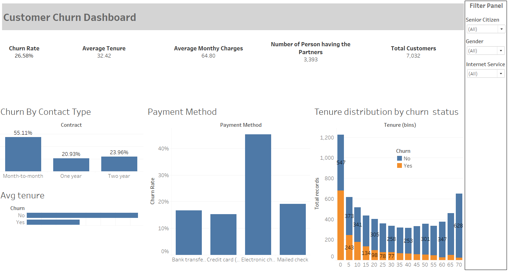

# Customer Churn Prediction and Dashboard Project

## Overview
This project aims to predict customer churn and provide business insights through data visualization to support strategic decision-making for customer retention. It combines machine learning and data visualization to help businesses understand which factors contribute most to customer attrition.

## Project Highlights
- **Machine Learning Model**  
  - Built a Random Forest classification model using Python’s Scikit-learn library.
  - Achieved **85% accuracy** in predicting whether a customer is likely to churn.
  - Analyzed a dataset of over **7,000 customers** to identify key churn drivers such as **contract type**, **tenure**, **monthly charges**, and customer demographics.

- **Interactive Tableau Dashboard**  
  - Designed and deployed an interactive dashboard to enable business users to explore the data.
  - Features include:
    - **Churn rate** visualization
    - **Average customer tenure**
    - **Monthly charges** distribution
    - Dynamic filters for **Senior Citizen status**, **Gender**, and **Internet Service** type
  - Helps business teams monitor churn trends and tailor retention strategies.

- **Exploratory Data Analysis (EDA)**  
  - Conducted thorough EDA using **Pandas**, **Seaborn**, and **Matplotlib** to understand customer behavior.
  - Uncovered actionable insights that informed both the model design and business recommendations.
  - Presented findings and recommendations to key stakeholders.

## Tools & Technologies
- Python: Scikit-learn, Pandas, Seaborn, Matplotlib
- Tableau
- Jupyter Notebook / Google Colab

## Business Impact
This project provides an end-to-end pipeline from raw data analysis to actionable business insights:
- Helps identify customer segments with the highest churn risk.
- Supports data-driven decision-making for marketing and customer success teams.
- Provides an interactive visualization tool for ongoing monitoring of key churn indicators.

## Screenshot

